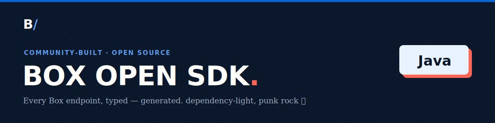

<!-- Generated by box-gantry. DO NOT EDIT. -->


# box-open-sdk (Java)

A **community, unofficial** Box API client for Java — one resource
manager per API area behind a single `dev.unofficialbox.Client`, over a
dependency-free `java.net.http` runtime with retry, backoff, and token
refresh.

> **Not affiliated with, authorized, or endorsed by Box, Inc.** "Box"
> is a trademark of Box, Inc. This is an independent, generated client.

## Install (Maven)

```xml
<dependency>
  <groupId>dev.unofficialbox</groupId>
  <artifactId>box-open-sdk</artifactId>
  <version>0.1.2</version>
</dependency>
```

## Usage

```java
dev.unofficialbox.Client client = new dev.unofficialbox.Client(
        dev.unofficialbox.runtime.Runtime.developerToken("DEVELOPER_TOKEN"));
```

## Parallel chunked upload (opt-in)

The core SDK compiles and runs on a plain JDK 26. `BoxChunkedUpload`
uploads a large file's parts **in parallel** using structured
concurrency, a Java 26 **preview** API — so it is a preview-marked class,
and code that calls it must pass `--enable-preview` at **both** compile
and run time (with `--release 26` for `javac`) to unlock the parallel path:

```java
// compile: javac --release 26 --enable-preview ...
// run:     java --enable-preview ...
var file = new dev.unofficialbox.BoxChunkedUpload(client)
        .upload(bytes, "large.bin", folderId);
```

Everything else compiles and runs without the flag.

See the `docs/` directory for per-manager reference and the
authentication, pagination, and errors guides.
